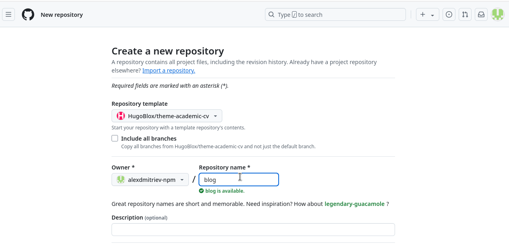
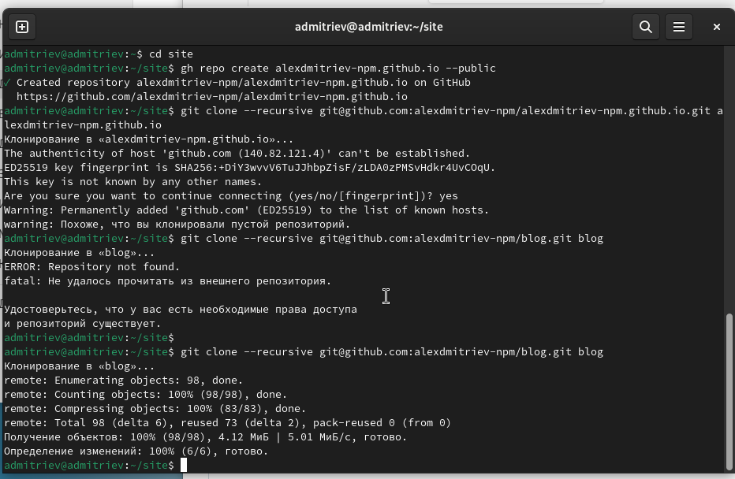
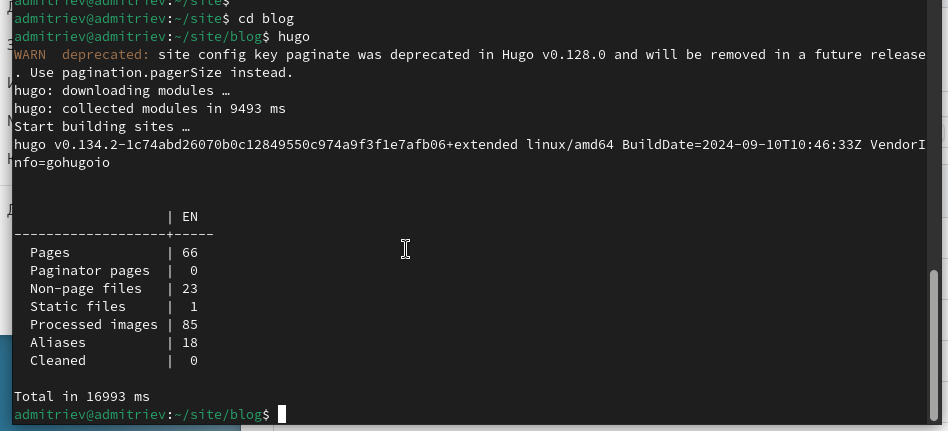
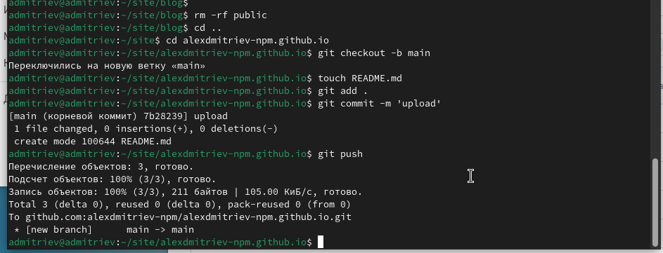
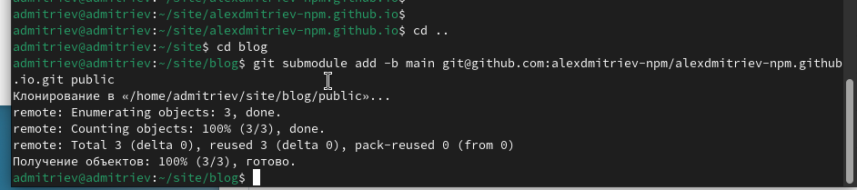
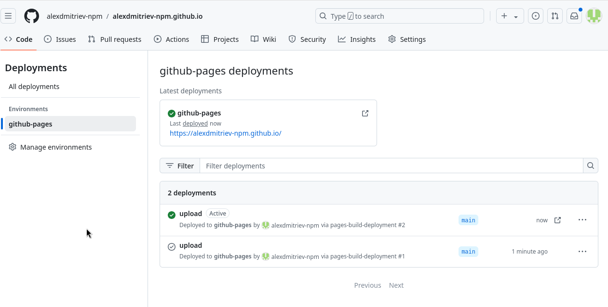

---
## Front matter
lang: ru-RU
title: Отчёт по 1 этапу проекта
author: Александр Дмитриев
institute: Российский Университет Дружбы Народов
date: 20 сентября, 2024, Москва, Россия

## Formatting
mainfont: PT Serif
romanfont: PT Serif
sansfont: PT Sans
monofont: PT Mono
toc: false
slide_level: 2
theme: metropolis
header-includes: 
 - \metroset{progressbar=frametitle,sectionpage=progressbar,numbering=fraction}
 - '\makeatletter'
 - '\beamer@ignorenonframefalse'
 - '\makeatother'
aspectratio: 43
section-titles: true

---

# Цели и задачи

## Цель лабораторной работы

Подготовить репозиторий на основе шаблона. 

Ознакомиться с генератором сайтов hugo.

# Выполнение лабораторной работы

## Создание репозитория из шаблона

{ #fig:001 width=70% height=70%}

## Создание локальных репозиториев

{ #fig:002 width=70% height=70%}

## Инициализация hugo

{ #fig:003 width=70% height=70%}

## Подготовка репозитория

{ #fig:004 width=70% height=70%}

## Подготовка папки public

{ #fig:005 width=70% height=70%}

## Развертывание сайта

{ #fig:006 width=70% height=70%}

# Выводы

## Результаты выполнения лабораторной работы

Подготовили репозиторий и установили hugo.