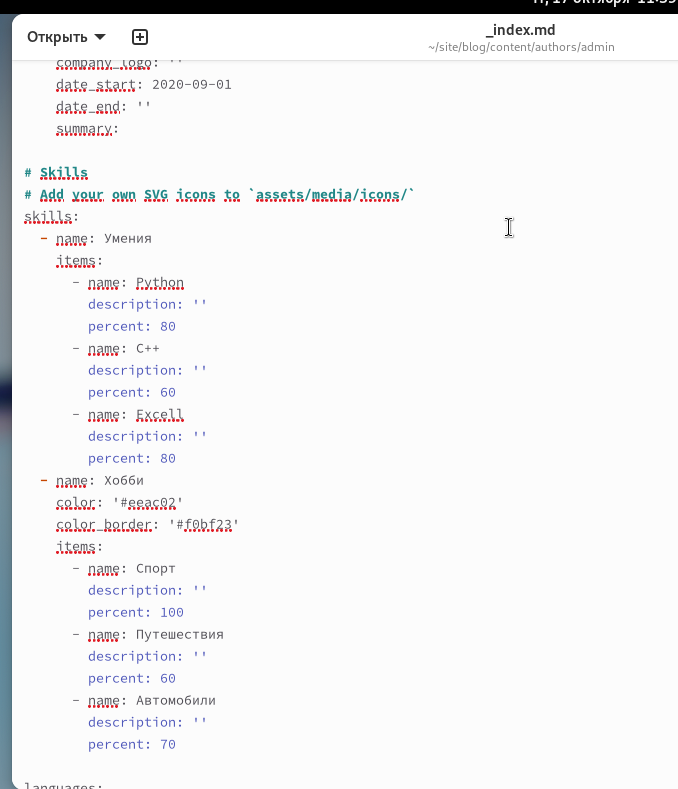
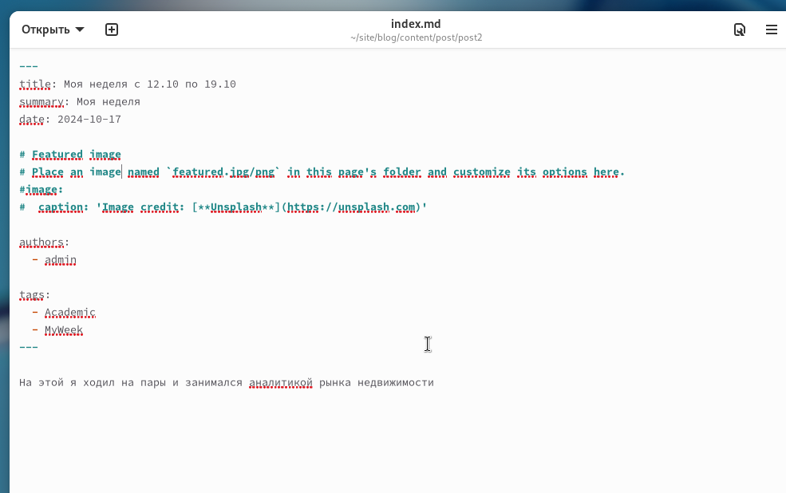
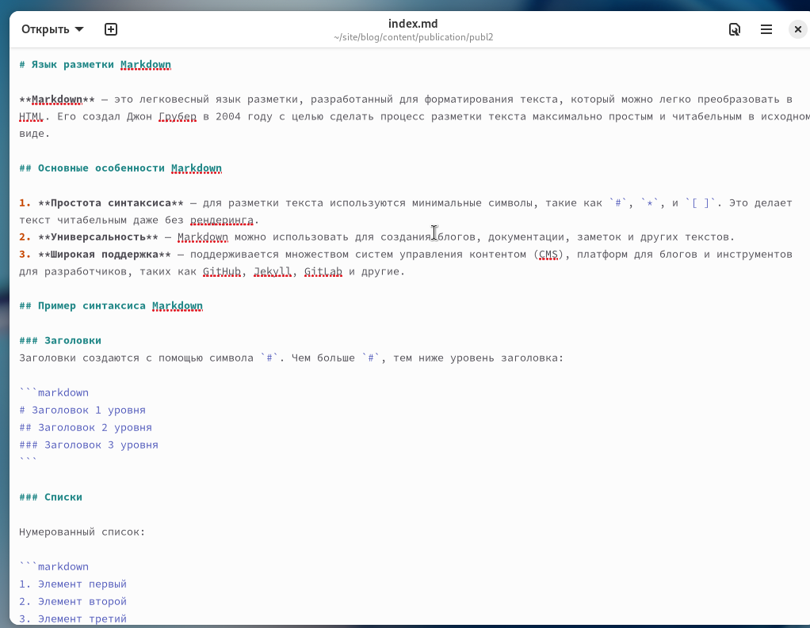

---
## Front matter
lang: ru-RU
title: Отчёт по 3 этапу проекта
author: Александр Дмитриев
institute: Российский Университет Дружбы Народов
date: 17 октября, 2024, Москва, Россия

## Formatting
mainfont: PT Serif
romanfont: PT Serif
sansfont: PT Sans
monofont: PT Mono
toc: false
slide_level: 2
theme: metropolis
header-includes: 
 - \metroset{progressbar=frametitle,sectionpage=progressbar,numbering=fraction}
 - '\makeatletter'
 - '\beamer@ignorenonframefalse'
 - '\makeatother'
aspectratio: 43
section-titles: true

---

# Цели и задачи

## Цель лабораторной работы

Добавить к сайту данные о себе.

# Выполнение лабораторной работы

## Файл об авторе

{ #fig:001 width=70% height=70%}

## Файл для поста

{ #fig:002 width=70% height=70%}

## Файл для публикации

{ #fig:003 width=70% height=70%}

# Выводы

## Результаты выполнения лабораторной работы

Добавили к сайту данные о себе.